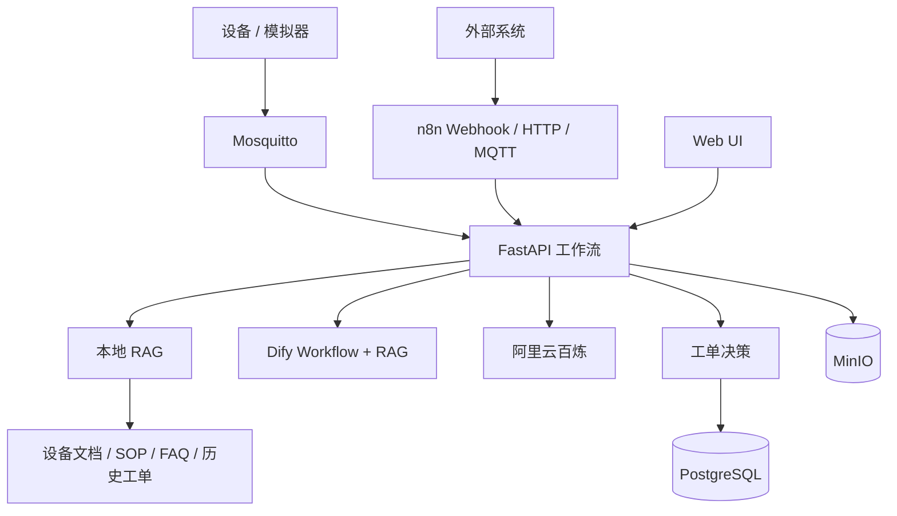

# Kita-AIoT：AIoT 设备运维智能体工作流系统

Kita-AIoT 是一个可本地部署的设备运维智能体。已形成完整闭环：

> 设备告警 → MQTT / n8n → Agent 分析 → RAG 检索 → 工单生成 → Web UI 展示

## 能力

- Dify 与阿里云百炼双平台切换演示。
- `auto / dify / bailian / local` 四种 Agent 模式。
- n8n Webhook、HTTP、MQTT 三种触发工作流。
- Web UI 展示设备、告警、工单和工作流记录。
- Web UI 支持手动运行完整告警链路。
- Web UI 支持知识库问答、平台切换和引用展示。
- 本地 Markdown RAG，可与 Dify 知识库并存。
- PostgreSQL 保存设备、告警、工单、问答、调用日志和执行记录。
- MinIO 保存说明书、现场图片和维修附件。
- critical、连续 warning 等规则自动生成工单。

## 架构



详细技术说明见 [docs/phase3_technical_guide.md](docs/phase3_technical_guide.md)。

## 快速启动

### 1. 配置

关键配置：

```env
DIFY_API_BASE_URL=http://host.docker.internal/v1
DIFY_API_KEY=app-xxxxxxxx
DIFY_WORKFLOW_ENABLED=true

BAILIAN_API_KEY=sk-xxxxxxxx
BAILIAN_MODEL=qwen-plus

# auto、dify、bailian 或 local
AGENT_PLATFORM=auto
```

### 2. 启动

```powershell
docker compose up -d --build
```

重启api以及其他服务
```powershell
docker compose up -d --build --force-recreate api
docker compose up -d --force-recreate mqtt minio postgres
```

重启dify
```powershell
docker compose up -d --force-recreate
```

| 服务 | 地址 |
| --- | --- |
| Web UI | <http://localhost:8001> |
| Swagger | <http://localhost:8001/docs> |
| n8n | <http://localhost:5678> |
| MinIO Console | <http://localhost:9001> |
| MQTT | `localhost:1883` |
| PostgreSQL | `localhost:5432` |

### 3. n8n

在 n8n 导入 `n8n/workflows/` 下三个工作流。MQTT 凭据和使用说明见 [n8n/README.md](n8n/README.md)。

## Web UI

首页分为两部分：

1. 运维看板
   - 设备状态
   - 实时告警
   - 工单列表
   - 工作流执行记录
2. Agent 控制台
   - 选择 Dify、百炼或本地平台
   - 手动触发完整告警闭环
   - 知识库问答
   - 查看 RAG 引用

## 双平台演示

### Dify

```powershell
.\.venv\Scripts\python.exe scripts\phase3_platform_demo.py --platform dify
```

### 阿里百炼

```powershell
.\.venv\Scripts\python.exe scripts\phase3_platform_demo.py --platform bailian
```

两个平台接收相同的设备状态、告警、历史告警和知识库证据，便于横向演示。

## n8n 演示

### Webhook

激活 `Kita-AIoT - Webhook 告警闭环`：

```powershell
curl.exe -X POST http://localhost:5678/webhook/kita-aiot/alarm `
  -H "Content-Type: application/json" `
  -d '{"device_id":"device-003","alarm_type":"device_offline","level":"critical","message":"n8n Webhook 演示","temperature":29.0,"platform":"dify"}'
```

### HTTP

在 n8n 中手动运行 `Kita-AIoT - HTTP 手动演示`。

### MQTT

激活 MQTT 工作流后：

```powershell
.\.venv\Scripts\python.exe scripts\mqtt_alarm_simulator.py `
  --host localhost `
  --topic aiot/device/alarm/n8n `
  --count 1 `
  --platform bailian
```

## 核心 API

| Method | API | 功能 |
| --- | --- | --- |
| `POST` | `/api/v1/alarms/report` | 运行告警完整闭环 |
| `GET` | `/api/v1/alarms/` | 告警列表 |
| `GET` | `/api/v1/work-orders/` | 工单列表 |
| `POST` | `/api/v1/knowledge/ask` | RAG 知识问答 |
| `GET` | `/api/v1/knowledge/queries` | 问答历史 |
| `POST` | `/api/v1/knowledge/platform-analyze` | 单独测试指定平台 |
| `GET` | `/api/v1/workflow-executions` | 工作流记录 |
| `GET` | `/api/v1/call-logs` | 平台与 HTTP 调用日志 |
| `POST` | `/api/v1/documents/` | 上传 MinIO 文档 |
| `GET` | `/api/v1/platforms/status` | 平台配置状态 |

告警请求示例：

```json
{
  "device_id": "device-001",
  "alarm_type": "temperature_high",
  "level": "warning",
  "message": "设备温度持续超过 80 摄氏度",
  "temperature": 86.8,
  "platform": "dify"
}
```

## RAG

当前本地 RAG：

- 按 Markdown 标题切分。
- 中文单字/二元组与英文词法混合检索。
- 标题命中加权。
- 返回 Top K 文档片段。
- 回答和告警结果均保留引用。

知识文档位于 `docs/knowledge_base/`。

## 工单规则

- `critical`：创建 P1 工单。
- 同一设备连续 3 次同类 `warning`：创建 P2 工单。
- 模型明确建议创建工单：使用模型优先级，并由服务端校验。
- 平台未配置时可以使用本地规则完成演示。

## 项目文档

- [技术说明](docs/phase3_technical_guide.md)
- [演示步骤](docs/phase3_demo.md)
- [告警分析 Prompt](docs/prompts/phase3_alarm_agent.md)
- [知识问答 Prompt](docs/prompts/phase3_knowledge_qa.md)
- [n8n 工作流说明](n8n/README.md)
- [Dify 配置](docs/dify_phase2_setup.md)
- [百炼配置](docs/bailian_phase2_setup.md)

## 验收说明

没有平台 Key 时可用 `platform=local` 验证完整业务链路。真实双平台演示需要：

- Dify Workflow 已发布并配置 API Key。
- 百炼 API Key 已写入 `.env`。
- Docker Desktop 正常运行。
- n8n MQTT 工作流已配置 Broker 凭据并激活。
