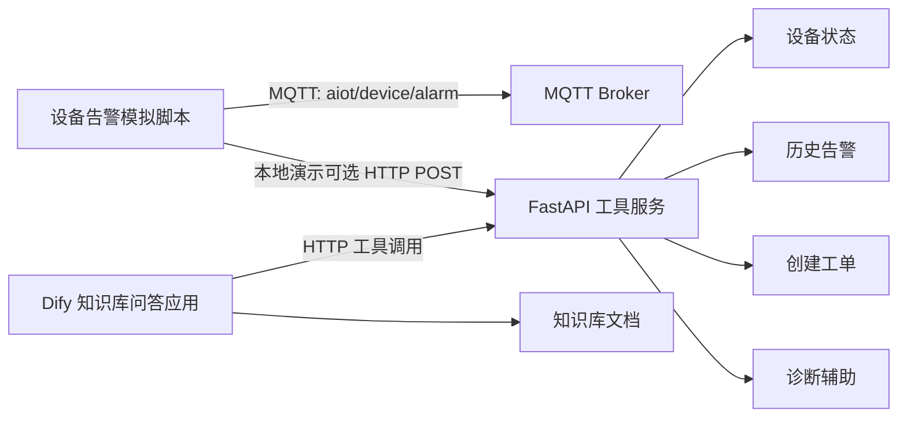
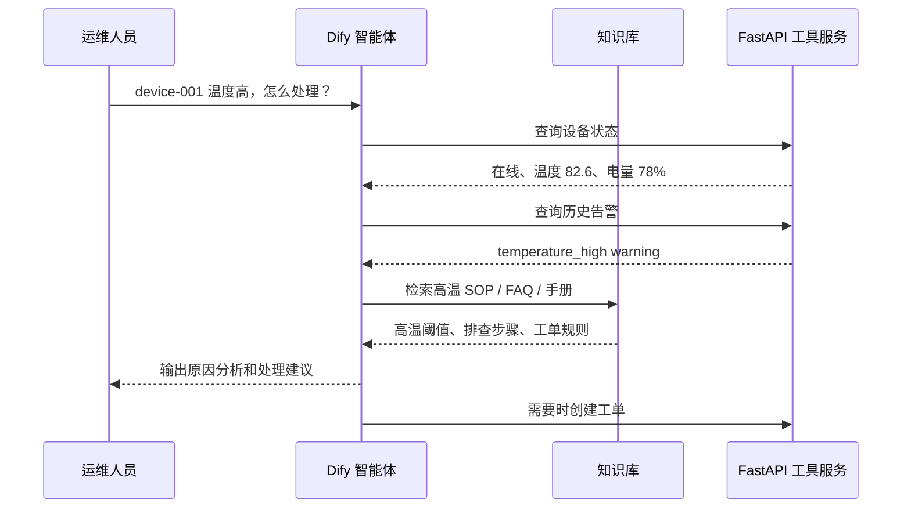

# Kita-AIoT：设备运维智能体工作流系统

Kita-AIoT 是一个面向 AIoT 场景的设备运维智能体工作流 Demo。项目基于 Dify / 阿里百炼等 AI 应用开发平台，结合 FastAPI、MQTT、PostgreSQL、Redis、MinIO 等后端组件，模拟设备告警上报、知识库检索、故障原因分析、处理建议生成与工单流转的智能运维闭环。

本项目主要用于探索 AI Agent、RAG 知识库、工作流编排与 AIoT 设备运维场景的结合方式。

第一阶段目标是先把“设备告警 -> 知识库问答 / 工具调用 -> 工单创建”的演示链路跑通，不引入 PostgreSQL、MinIO、n8n 等较重依赖。二、三阶段再逐步接入数据库、对象存储、更多平台和前端页面。

## 项目背景

在 AIoT 设备运维场景中，设备数量多、告警类型复杂、处理流程依赖人工经验，常见问题包括：

- 设备告警信息分散，人工排查效率较低。
- 故障处理依赖说明书、SOP、历史工单等文档资料。
- 运维人员需要频繁查询设备状态、历史告警和处理记录。
- 告警分析、知识检索、工单创建等流程缺少自动化串联。

因此，本项目尝试将大模型智能体引入设备运维流程，通过 Agent 工具调用、RAG 知识库检索和自动化工作流编排，实现从“设备告警”到“故障分析”和“工单生成”的自动化处理。

## 当前阶段完成情况

| 一阶段要求 | 当前状态 | 说明 |
| --- | --- | --- |
| Dify 搭一个知识库问答应用 | 已提供配置说明 | 见 `docs/dify_phase1_setup.md`，按步骤在 Dify 控制台创建知识库和 Chat/Agent 应用 |
| 上传 3～5 份设备说明书 / SOP / FAQ 模拟文档 | 已完成 | 见 `docs/knowledge_base/`，共 5 份 Markdown 文档 |
| FastAPI 写 3 个工具接口 | 已完成 | 设备状态、历史告警、创建工单；另提供一个诊断辅助接口 |
| MQTT 用脚本模拟告警上报 | 已完成 | 见 `scripts/mqtt_alarm_simulator.py` |
| README 写清楚架构、流程、截图 | 已更新 | 本 README 包含架构、流程、演示命令；Dify 截图保存位置见 `docs/screenshots/` |

## 核心功能

### 设备运维智能体

基于 Dify 搭建设备运维知识库问答 / Agent 应用，围绕设备告警分析、知识库检索、处理建议生成和工单创建设计演示流程。

智能体支持：

- 根据用户问题识别意图。
- 自动调用设备状态查询工具。
- 查询设备历史告警。
- 检索设备知识库和历史工单。
- 生成故障原因分析和结构化处理建议。
- 在需要时创建运维工单。

### 企业知识库 RAG

当前阶段提供 5 份模拟资料，可直接上传到 Dify 知识库：

- 设备说明书。
- 故障排查手册。
- 运维 SOP。
- 历史工单样例。
- 常见问题 FAQ。

### FastAPI 工具服务

| 工具名称 | 接口 | 功能说明 |
| --- | --- | --- |
| `get_device_status` | `GET /api/v1/devices/{device_id}/status` | 根据设备 ID 查询在线状态、电量、温度、位置等信息 |
| `get_recent_alarms` | `GET /api/v1/devices/{device_id}/alarms` | 查询设备最近告警记录 |
| `create_work_order` | `POST /api/v1/work-orders` | 根据分析结果创建运维工单 |
| `device_diagnosis` | `POST /api/v1/tools/device-diagnosis` | 演示用诊断辅助接口，汇总状态、告警和知识库式建议 |

## 技术栈

| 类型 | 一阶段使用 | 后续规划 |
| --- | --- | --- |
| AI 应用平台 | Dify 配置说明 | 阿里百炼完整接入 |
| 后端服务 | Python、FastAPI | 服务拆分、调用日志 |
| 消息通信 | MQTT 模拟脚本 | MQTT 触发工作流 |
| 数据库 | 内存模拟数据 | PostgreSQL |
| 对象存储 | 暂不接入 | MinIO |
| 自动化编排 | Dify 手动配置 | n8n Webhook / HTTP / MQTT |

## 项目结构

```text
Kita-AIoT/
├── app/
│   ├── __init__.py
│   ├── mqtt/
│   │   └── simulator.py              # 兼容 README 原启动路径的包装脚本
│   └── main.py                      # FastAPI 工具接口与一阶段内存数据
├── docs/
│   ├── dify_phase1_setup.md          # Dify 一阶段配置步骤
│   ├── knowledge_base/               # Dify 知识库模拟文档
│   ├── prompts/                      # Dify Prompt 模板
│   └── screenshots/                  # Dify 配置和演示截图建议保存位置
├── scripts/
│   ├── __init__.py
│   └── mqtt_alarm_simulator.py       # MQTT 告警模拟脚本
├── .env.example
├── requirements.txt
└── README.md
```

## 一阶段架构



说明：

- Dify 负责知识库问答、RAG 检索和 Agent 编排。
- FastAPI 负责把设备状态、历史告警、创建工单封装成可调用工具。
- MQTT 脚本负责生成模拟告警。第一阶段可只打印 / 发布 MQTT，也可以同时 POST 到 FastAPI 便于本地演示。
- 当前数据使用内存模拟，重启服务后新创建工单和上报告警会丢失。

## 快速启动

### 1. 安装依赖

Windows PowerShell：

```powershell
python -m venv .venv
.\.venv\Scripts\python -m pip install -r requirements.txt
```

### 2. 启动 FastAPI

```powershell
.\.venv\Scripts\python -m uvicorn app.main:app --reload --host 0.0.0.0 --port 8001
```

启动后打开：

- API 文档：http://localhost:8001/docs
- 健康检查：http://localhost:8001/health

### 3. 调用三个智能体工具接口

查询设备状态：

```powershell
curl http://localhost:8001/api/v1/devices/device-001/status
```

查询历史告警：

```powershell
curl "http://localhost:8001/api/v1/devices/device-001/alarms?limit=5"
```

创建工单：

```powershell
curl.exe -X POST http://localhost:8001/api/v1/work-orders `
  -H "Content-Type: application/json" `
  -d '{
    "device_id": "device-001",
    "alarm_id": "alarm-001",
    "title": "冷链温控网关高温告警处理",
    "reason": "设备持续高温，可能存在散热受阻或环境温度异常。",
    "suggestion": "检查散热口、风扇状态和冷库环境温度。",
    "priority": "P2"
  }'
```

诊断辅助接口：

```powershell
curl.exe -X POST http://localhost:8001/api/v1/tools/device-diagnosis `
  -H "Content-Type: application/json" `
  -d '{
    "device_id": "device-001",
    "question": "设备持续温度过高，应该如何处理？"
  }'
```

## API 清单

| 接口 | 方法 | 用途 |
| --- | --- | --- |
| `/health` | GET | 服务健康检查 |
| `/api/v1/devices/{device_id}/status` | GET | 工具 1：查询设备状态 |
| `/api/v1/devices/{device_id}/alarms` | GET | 工具 2：查询历史告警 |
| `/api/v1/work-orders` | POST | 工具 3：创建工单 |
| `/api/v1/work-orders` | GET | 查看当前内存中的工单 |
| `/api/v1/tools/device-diagnosis` | POST | 诊断辅助接口，便于 Agent 演示 |
| `/api/v1/alarms/report` | POST | 本地演示用：直接接收模拟告警 |

内置设备：

- `device-001`：冷链温控网关 A-01，高温告警样例。
- `device-002`：产线振动传感器 B-12，振动告警样例。
- `device-003`：边缘采集器 C-07，离线告警样例。

## MQTT 告警模拟

只打印模拟告警，不连接 MQTT Broker：

```powershell
.\.venv\Scripts\python scripts/mqtt_alarm_simulator.py --dry-run --count 3
```

也可以使用兼容路径：

```powershell
.\.venv\Scripts\python app/mqtt/simulator.py --dry-run --count 3
```

发布到本机 MQTT Broker：

```powershell
.\.venv\Scripts\python scripts/mqtt_alarm_simulator.py --host localhost --port 1883 --topic aiot/device/alarm --count 3
```

本地没有 MQTT Broker 时，也可以把模拟告警直接 POST 到 FastAPI，方便演示告警入库效果：

```powershell
.\.venv\Scripts\python scripts/mqtt_alarm_simulator.py `
  --dry-run `
  --count 1 `
  --post-url http://localhost:8001/api/v1/alarms/report
```

示例 Payload：

```json
{
  "device_id": "device-001",
  "alarm_type": "temperature_high",
  "level": "warning",
  "message": "设备温度超过 80 摄氏度阈值",
  "temperature": 82.6,
  "timestamp": "2026-06-23T10:20:00+08:00"
}
```

## Dify 一阶段配置

详细步骤见 `docs/dify_phase1_setup.md`。

建议流程：

1. 在 Dify 创建知识库，上传 `docs/knowledge_base/` 下 5 份文档。
2. 创建 Chatflow 或 Agent 应用，系统 Prompt 使用 `docs/prompts/dify_phase1_prompt.md`。
3. 配置三个 HTTP 工具：
   - `get_device_status`: `GET /api/v1/devices/{device_id}/status`
   - `get_recent_alarms`: `GET /api/v1/devices/{device_id}/alarms`
   - `create_work_order`: `POST /api/v1/work-orders`
   - 可选：`device_diagnosis`: `POST /api/v1/tools/device-diagnosis`
4. 用以下问题测试：
   - `device-001 温度高应该怎么处理？请查询设备状态和历史告警。`
   - `device-003 离线超过 30 分钟，是否需要创建工单？`
   - `温度超过 80 摄氏度时 SOP 怎么要求？`

如果 Dify 运行在 Docker 容器内，工具 URL 中的 `localhost` 需要替换为宿主机 IP 或同一 Docker 网络中的服务名。

## 演示流程



## 截图说明

Dify 控制台截图需要在本地完成配置后手动保存，建议放到 `docs/screenshots/`：

- `dify_knowledge_base.png`：知识库文档列表。
- `dify_tools.png`：三个 HTTP 工具配置。
- `dify_chat_demo.png`：一次问答演示，包含引用来源和工具调用结果。

仓库当前已经保留 `docs/screenshots/.gitkeep`，方便后续提交截图。

## 后续阶段规划

二阶段：

- Dify 或阿里百炼至少一个平台完整跑通，另一个平台做基础接入或截图。
- FastAPI 工具接口扩展到 5 个左右。
- 引入 PostgreSQL，设计设备表、告警表、工单表、调用日志表。
- 引入 MinIO 存放设备文档或图片。
- MQTT 告警触发工作流，增加调用日志和工作流执行记录。
- README 增加架构图、演示视频或 GIF。

三阶段：

- Dify + 阿里百炼两个平台都能演示。
- n8n 做 Webhook / HTTP / MQTT 触发流。
- 增加简单前端页面，支持告警列表、工单列表、知识库问答。
- 打通完整链路：设备告警 -> Agent 分析 -> RAG 检索 -> 生成工单。
- 补充项目说明文档，专门讲技术选型、Prompt、RAG 优化和工具调用设计。
