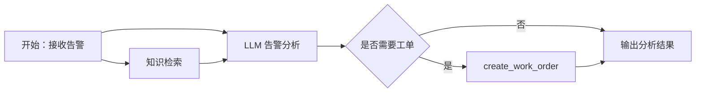

# Dify 完整接入

以 Dify Workflow 为主平台。FastAPI 提供工具和 MQTT 触发入口，Dify 负责大模型分析与知识库检索。

## 1. 创建知识库

上传 `docs/knowledge_base/` 下全部文档，建议开启引用来源，Top K 设置为 3。

## 2. 导入 5 个工具

在 Dify 的“工具 → 自定义工具”中导入 `docs/dify_tools_openapi.yaml`。

如果 Dify 运行在 Docker 中：

- Windows/macOS Docker Desktop 可使用 `host.docker.internal:8001`。
- Linux 使用宿主机 IP，或把 Dify 与 Kita-AIoT API 放入同一 Docker 网络。

导入后应出现：

1. `get_device_status`
2. `get_recent_alarms`
3. `diagnose_device`
4. `create_work_order`
5. `list_device_documents`

## 3. 创建告警分析 Workflow

创建 Workflow 应用，定义以下输入变量：

| 变量 | 类型 |
| --- | --- |
| `device_id` | string |
| `alarm_id` | string |
| `alarm_type` | string |
| `alarm_level` | string |
| `alarm_message` | string |
| `device_status` | object/string |
| `local_diagnosis` | object/string |

建议节点：



LLM Prompt 可使用：

```text
你是 Kita-AIoT 设备运维智能体。
请结合输入告警、设备状态、本地诊断和知识库内容，输出：
1. 告警概述
2. 可能原因
3. 排查步骤
4. 风险等级
5. 是否需要创建工单

critical 告警必须建议创建 P1 工单；重复 warning 建议创建 P2 工单。
不得编造设备参数，并在结论中标注知识库依据。
```

将结束节点输出至少设置为 `analysis`、`should_create_work_order`、`references`。

## 4. 获取 Workflow API 凭据

在 Dify 应用的“访问 API”页面复制 API Key，并配置 `.env`：

```env
DIFY_API_BASE_URL=http://localhost/v1
DIFY_API_KEY=app-xxxxxxxx
DIFY_WORKFLOW_ENABLED=true
```

如果 FastAPI 在 Docker Compose 内、Dify 在宿主机，请把地址改成可从 API 容器访问的地址。

## 5. 验收

启动 Kita-AIoT 后发布 MQTT 告警：

```powershell
.\.venv\Scripts\python.exe scripts\mqtt_alarm_simulator.py --host localhost --count 1
```

检查：

- Dify Workflow 出现一次运行记录。
- `/api/v1/workflow-executions` 中平台为 `dify`、状态为 `succeeded`。
- PostgreSQL 中新增告警和工作流执行记录。
- critical 告警自动生成 P1 工单。
- `/api/v1/call-logs` 可看到工具接口调用。

若暂未配置 Dify，工作流会使用本地规则执行，平台字段为 `local`。
