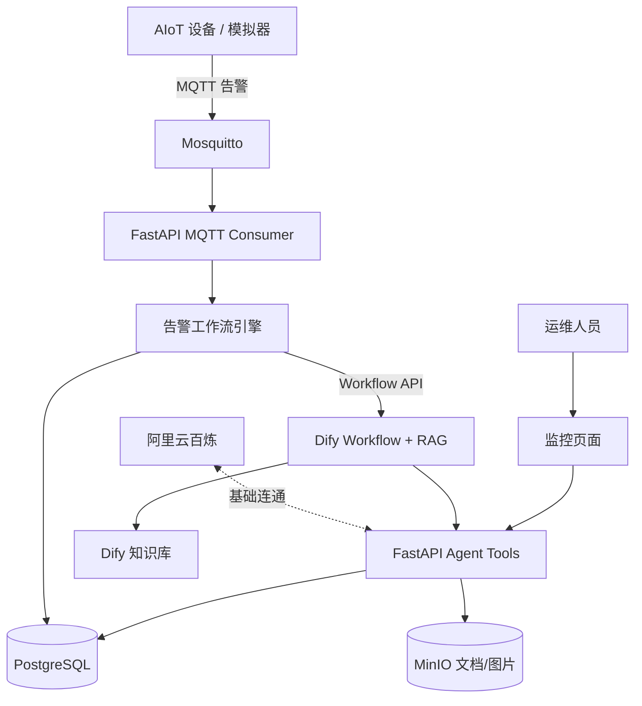
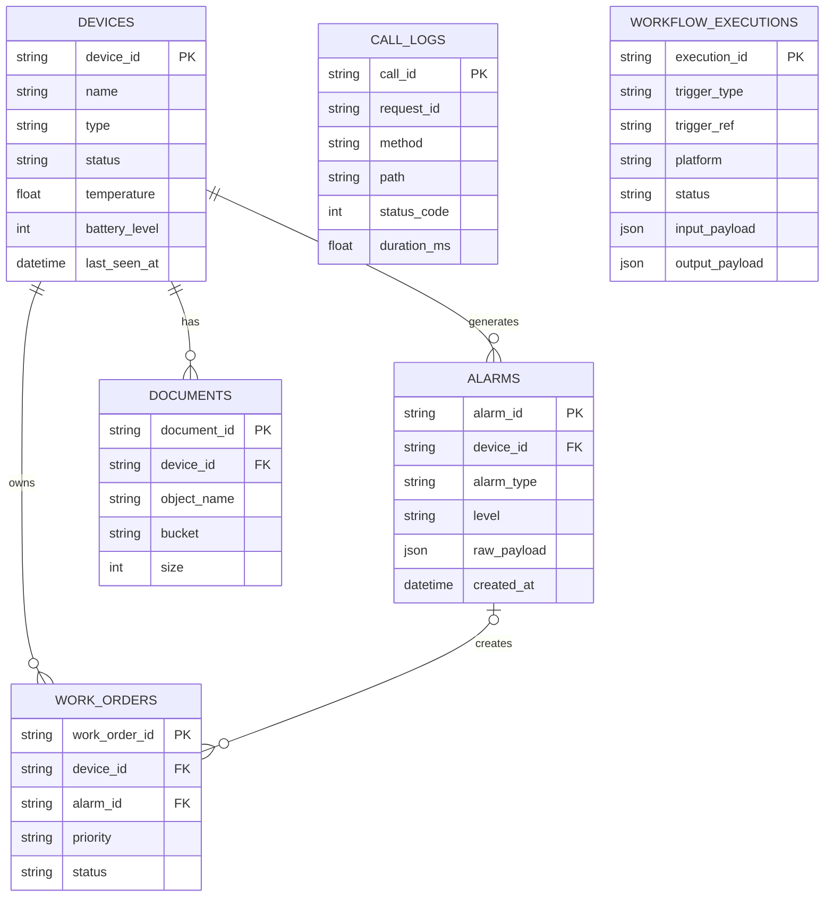
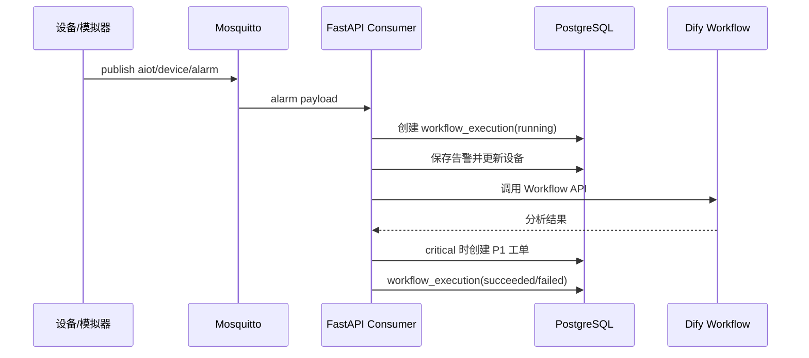

# Kita-AIoT 二阶段设计

## 目标

- Dify 完整承接告警分析 Workflow。
- 阿里云百炼完成 OpenAI 兼容接口基础接入。
- FastAPI 提供约 5 个 Agent 工具。
- PostgreSQL 持久化设备、告警、工单、调用日志和工作流执行记录。
- MQTT 告警自动触发工作流。
- MinIO 保存设备文档或图片。
- Web 页面展示设备、告警、工单和工作流状态。

## 总体架构

## 数据模型

## MQTT 工作流

## 容错策略

- Dify 未配置时，使用本地规则诊断，保证本地演示链路可运行。
- 工作流异常写入 `workflow_executions.error_message`。
- HTTP 日志写入失败不会影响业务响应。
- MinIO 未启用时文档接口返回 503，并给出配置提示。
- 数据库连接使用 `pool_pre_ping` 检测失效连接。
