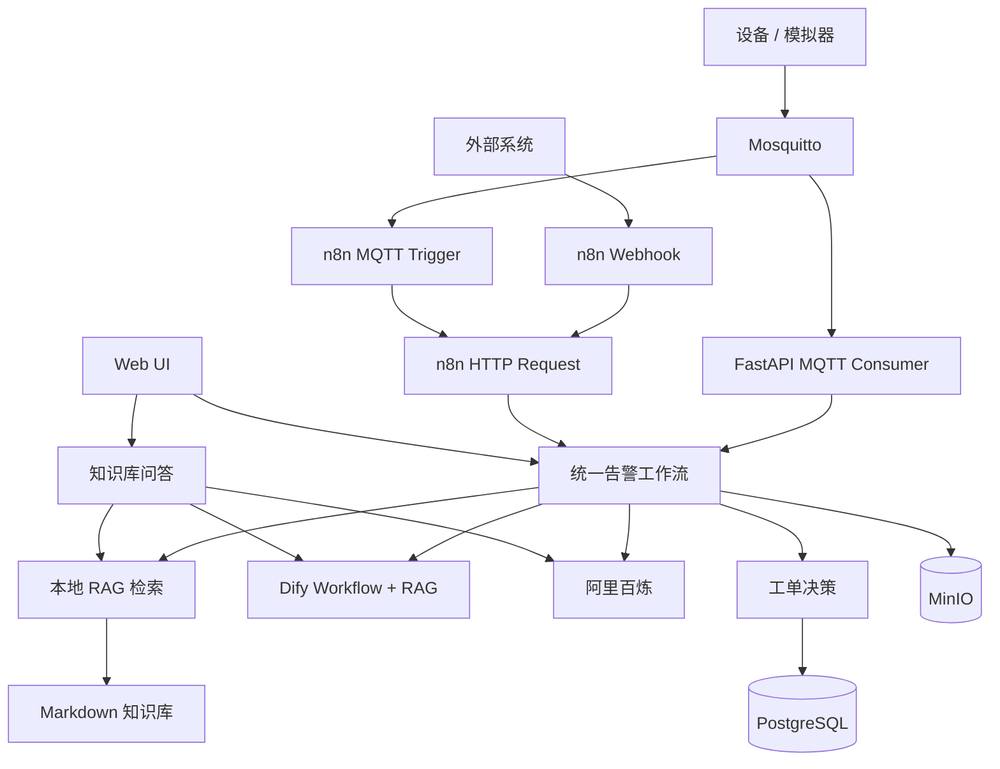
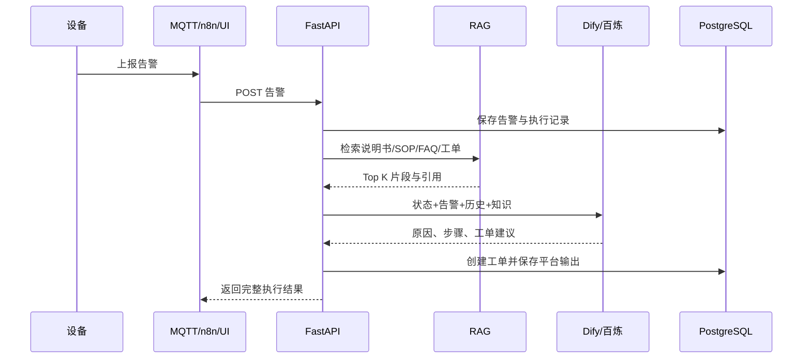

# Kita-AIoT 技术说明

本文专门说明的技术选型、Prompt、RAG 优化和工具调用设计。

## 1. 技术选型

### FastAPI

FastAPI 作为统一业务入口，承担：

- Dify 和百炼的工具服务。
- MQTT、n8n Webhook 和前端请求的统一接入。
- 参数校验、调用日志和错误归一化。
- PostgreSQL、MinIO 与平台 API 的业务编排。

选择原因是接口模型清晰、OpenAPI 自动生成、异构平台接入成本低。

### Dify

Dify 作为可视化 Agent/RAG 平台，适合演示：

- 知识库导入和检索。
- Workflow 节点编排。
- LLM、条件判断与 HTTP 工具调用。
- 可视化执行详情和引用来源。

### 阿里云百炼

百炼通过 OpenAI 兼容 Chat Completions API 接入，负责展示：

- 同一套业务上下文切换不同模型平台。
- JSON 结构化告警分析。
- 本地 RAG 上下文与云模型组合。

平台差异被封装在 `app/services/platforms.py`，业务层不直接依赖供应商响应结构。

### n8n

n8n 用于外部自动化编排：

- Webhook 接收第三方告警。
- HTTP Request 调用 Kita-AIoT 工作流。
- MQTT Trigger 订阅设备告警。

n8n 不承担核心业务规则。它只做触发和跨系统连接，避免业务逻辑散落在多个工作流平台。

### PostgreSQL / MinIO / Mosquitto

- PostgreSQL：设备、告警、工单、问答、调用日志和工作流记录。
- MinIO：设备文档、现场照片和维修附件。
- Mosquitto：轻量 MQTT Broker，适合本地演示。

## 2. 架构



## 3. Prompt 设计

Prompt 分为告警分析和知识问答两类，模板位于 `docs/prompts/`。

### 告警分析 Prompt

关键约束：

- 明确角色和业务边界。
- 输入包含设备状态、当前告警、历史告警和 RAG 上下文。
- 强制结构化 JSON 输出。
- 工单优先级规则写入 Prompt，但服务端仍保留确定性校验。
- 要求返回引用，减少无法追踪的结论。

### 知识问答 Prompt

关键约束：

- 只允许使用检索上下文。
- 信息不足时拒绝猜测。
- 阈值和时限必须有引用。
- 输出面向运维执行，不追求长篇解释。

### 为什么服务端仍保留规则

LLM 输出具有概率性。critical 必须建单、重复 warning 建单等规则属于业务安全约束，因此由服务端再次判断。模型负责分析，代码负责兜底。

## 4. RAG 设计与优化

### 当前检索流程

1. 按 Markdown 一级、二级标题切分文档。
2. 提取英文词、数字、中文单字和中文二元组。
3. 对标题命中、正文命中和覆盖率分别计分。
4. 返回 Top K 片段。
5. 将片段内容和来源交给 Dify/百炼。
6. API 响应保留原始引用，前端直接展示。

### 为什么保留本地检索

- 百炼演示不依赖 Dify 知识库。
- 外部平台异常时仍可本地问答。
- 可以对两个平台使用相同证据做横向比较。
- 引用可直接被服务端验证和记录。

### 后续优化方向

- 使用中文向量模型和 pgvector 替换词法检索。
- 标题、设备型号、告警类型使用 metadata 过滤。
- 混合检索：BM25 + 向量召回 + reranker。
- 为历史工单增加时间衰减和处理结果权重。
- 建立离线评测集，跟踪 Recall@K、引用正确率和答案忠实度。
- 文档更新后按内容 Hash 增量重建索引。

## 5. 工具调用设计

核心工具保持单一职责：

| 工具 | 读写 | 设计理由 |
| --- | --- | --- |
| 查询设备状态 | 只读 | 提供实时上下文 |
| 查询历史告警 | 只读 | 判断重复、持续和关联告警 |
| 设备诊断 | 只读 | 提供确定性基础诊断 |
| 创建工单 | 写入 | 单独控制副作用 |
| 查询设备文档 | 只读 | 为 Agent 提供附件元数据 |
| 知识问答 | 读写日志 | 返回答案、引用并保留查询记录 |

### 副作用控制

- 创建工单与分析接口分离。
- 服务端校验设备和告警是否存在。
- 每次平台调用写入 `call_logs`。
- 每次流程写入 `workflow_executions`。
- 平台失败时记录完整错误，但不泄漏 API Key。

## 6. 双平台适配

`platform` 支持：

- `dify`
- `bailian`
- `local`
- `auto`

`auto` 按配置优先级选择可用平台。Dify 与百炼的输出统一包装为：

```json
{
  "platform": "dify",
  "analysis": {},
  "raw": {},
  "references": []
}
```

因此告警、工单和前端代码无需理解供应商特有字段。

## 7. 完整链路


